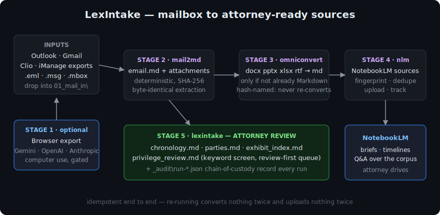
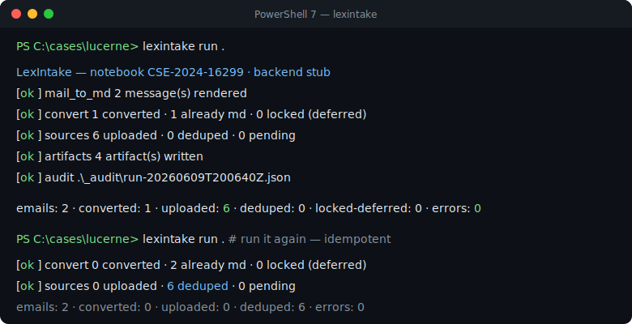

<div align="center">

# ⚖️ LexIntake

**Mailbox → Markdown → deduped NotebookLM sources → attorney-review artifacts.**
One command. Idempotent. Windows-first.

[](https://github.com/fredm23579/lexintake/actions)




</div>

---

LexIntake glues three independent projects into one legal intake workflow:

| Stage | Engine | What it does |
|---|---|---|
| **1 · Export** *(optional)* | [mail2md-computer-use](https://github.com/fredm23579/mail2md-computer-use) | Policy-gated browser export of Gmail/Outlook into `.eml` — Gemini, OpenAI, or Anthropic computer use |
| **2 · Mail → Markdown** | mail2md | Deterministic `email.md` + byte-identical attachments (SHA-256 chain of custody) |
| **3 · Convert** | [omniconvert-md](https://github.com/fredm23579/omniconvert-md) | `.docx .pptx .xlsx .rtf .msg` → Markdown — **only if not already** Markdown/native |
| **4 · Sources** | [notebooklm-manager](https://github.com/fredm23579/notebooklm-manager) | Fingerprint, dedupe, upload, and track everything as NotebookLM sources |
| **5 · Artifacts** | LexIntake | Chronology, parties index, exhibit index, privilege-review queue — for attorney review |

Re-running a workspace is always safe: **nothing converts twice, nothing
uploads twice** (content-hash dedup at both layers), and every run writes a
JSON audit record under `_audit/`.



## 🚀 Install (Windows, one line)

```powershell
irm https://raw.githubusercontent.com/fredm23579/lexintake/main/scripts/Install-LexIntake.ps1 | iex
```

That clones the four repos, builds an isolated venv under
`%LOCALAPPDATA%\LexIntake`, puts `lexintake` on your PATH, and runs
`lexintake doctor`. Re-run it any time to update. Prerequisites: git +
Python 3.11+ ([python.org](https://www.python.org/downloads/windows/),
check *Add to PATH*).

<details>
<summary><b>Manual / macOS / Linux install</b></summary>

```bash
git clone https://github.com/fredm23579/lexintake
git clone https://github.com/fredm23579/mail2md-computer-use
git clone https://github.com/fredm23579/omniconvert-md
git clone https://github.com/fredm23579/notebooklm-manager

python3 -m venv .venv && source .venv/bin/activate
pip install -e "./omniconvert-md[documents,msg]" -e ./notebooklm-manager
pip install --no-deps -e ./mail2md-computer-use
pip install "markdownify>=1.2,<2" "extract-msg>=0.55,<1" "typer>=0.16,<1"
pip install --no-deps -e ./lexintake
```
</details>

## 📋 Daily use

```powershell
# once per matter
lexintake init C:\cases\lucerne --notebook CSE-2024-16299

# drag mail out of Outlook (or export from Clio / iManage) into
#   C:\cases\lucerne\01_mail_in\
# then:
lexintake run C:\cases\lucerne
```

Or go hands-free — watch the inbox folder and run on every drop:

```powershell
pwsh scripts\Watch-MailIn.ps1 -Workspace C:\cases\lucerne
```

Or scheduled: import [`examples/n8n-lexintake-workflow.json`](examples/n8n-lexintake-workflow.json)
into n8n (weeknights 2 a.m., emails the paralegal on failure), or use Task
Scheduler with `lexintake run C:\cases\lucerne`.

### What you get

```
C:\cases\lucerne\
├── lexintake.toml          ← per-case config (examples/lexintake.toml)
├── 01_mail_in\             ← you drop .eml / .msg / .mbox here
├── 02_mail_md\             ← email.md + attachments\ per message
├── 03_converted\           ← Office docs as Markdown, content-hash named
├── 05_artifacts\
│   ├── chronology.md       ← every email, date-sorted, linked
│   ├── parties.md          ← every address: count, first/last seen
│   ├── exhibit_index.md    ← every attachment + SHA-256 (chain of custody)
│   └── privilege_review.md ← keyword-flagged messages, review-FIRST queue
└── _audit\run-*.json       ← what every run did, verbatim
```

### Live mailbox export (Stage 1)

```powershell
$env:GEMINI_API_KEY = "..."
lexintake export C:\cases\lucerne --query "label:lucerne newer_than:1y" --execute
```

You log in yourself — the agent never sees your password. OpenAI and
Anthropic computer-use adapters are built in; see
[docs/PROVIDERS.md](docs/PROVIDERS.md) for setup and the security posture.

### All commands

| Command | Purpose |
|---|---|
| `lexintake init <ws> --notebook ID` | Create `lexintake.toml` + folders |
| `lexintake run [ws]` | Stages 2–5, fully offline |
| `lexintake export [ws] --query Q --execute` | Stage 1 browser export, then run |
| `lexintake status [ws]` | Tracked sources + last audit record |
| `lexintake doctor [ws]` | Python/provider/folder readiness report |

## 🪟 Built for law-firm Windows

* **Long paths** — `\\?\` extended-length handling; nested OneDrive case
  folders with discovery-length filenames just work.
* **Locked files** — attachments held open by Word/Outlook/Acrobat are
  *deferred to the next run with a warning*, never a crash.
* **Illegal names** — `RE: memo? <final>` subjects and `CON.pdf` attachments
  are sanitized (reserved device names, illegal chars, trailing dots).
* **OneDrive/UNC awareness** — `doctor` flags cloud-synced workspaces.
* **Product detection** — `doctor` finds Outlook saved-mail, Clio, iManage,
  and NetDocuments export folders automatically.
* **PowerShell 7 native** — installer, watcher, and Task Scheduler-ready CLI.

## 🧪 Tests

```bash
python -m pytest   # 36 tests, offline, no API keys
```

The suite locks in the load-bearing guarantees: convert-if-not-already,
rename-proof hash skip, idempotent dedup, locked-file deferral, Windows name
sanitization, privilege-screen accuracy, and valid TOML round-trips. CI runs
the matrix on **windows-latest and ubuntu-latest** × Python 3.11/3.14.

## ⚠️ Honest boundaries

* The default `stub` backend is local and fully offline — ideal for review
  workflows and testing. Real NotebookLM upload requires the `enterprise`
  backend (NotebookLM Enterprise / Agentspace credentials); the free
  NotebookLM product has no official upload API.
* The privilege queue is a **keyword screen to order review** — never a
  privilege determination, and absence of a flag is not clearance.
* Stage 1 sends mailbox screenshots to the chosen model vendor. Clear that
  with your firm before using it on client matters; Stages 2–5 never touch
  the network (stub backend).
* Generated artifacts are review accelerators. **Verify before filing.**

## License

MIT — see [LICENSE](LICENSE).
